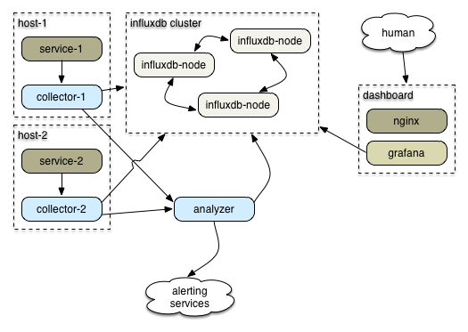

# numbat-analyzer

An alerting engine for the numbat-powered metrics & monitoring system.

This is the same approach I wanted in my initial spike, only instead of writing a custom collector & using an existing alerting engine (riemann), I'm writing the collector *and* the alerting engine.

## The system

Design:

- There's a cluster of [InfluxDB](http://influxdb.com)s.
- Each host runs a [numbat-collector](https://github.com/ceejbot/numbat-collector).
- Each service has a client that sends a heartbeat to `numbat-collector`.
- Each service also sends interesting datapoints to `numbat-collector`.
- The per-host collectors send all data to InfluxDB.
- They also send it to the `numbat-analyzer`.
- `numbat-analyzer` analyzes stats & feeds data to InfluxDB.
- `numbat-analyzer` is also responsible for sending alerts & generating timeseries events for these alerts.
- A [grafana](http://grafana.org) dashboard shows the data.
- If this service does its job, you delete your nagios installation.

An example setup might look like this, with many service/collector pairs:



NOTE: This is essentially what we run in production at npm, but the documentation for this component is lagging way behind.

### Data flow

Implications:

- everything goes into InfluxDB: metrics, operational actions, other human actions
- Dashboard needs to include both visual data (graphs) & current alert status
- data should probably get tagged with "how to display this" so a new stream of info from numbat can be displayed usefully sans config
- Dashboard should link to the matching Grafana historical data displays for each metric.

CONSIDER: dashboard data displays *are* grafana, just of a different slice of influxdb data (rotated out regularly?) Dashboard page then becomes grafana with the alert stuff in an iframe or something like that. In this approach, the dashboard service is an extra-complex configurable set of hekad-style rules in javascript instead of Lua.

The piece that needs to be written:

[numbat-emitter](https://github.com/ceejbot/numbat-emitter): a module you're intended to require anywhere you need it. Make an emitter object, hang onto it, emit metrics with it.  
[numbat-collector](https://github.com/ceejbot/numbat-collector): receiver that runs on every host  
`numbat-analyzer`: a server that accepts data streams from the collector & processes them

- processing rules are *duplex streams*
- probably a directory full of them that gets auto-reloaded? static on startup initially, though
- rules write out actionable items (alerts, new data, etc)
- sends generated events back to any configured output

Outgoing integrations:

- pagerduty
- slack messages (this is an existing output rule)

### What does a metric data point look like?

It must be a valid InfluxDB data point. Inspired by Riemann's events.

```javascript
{
    host: 'hostname.example.com',
    name: 'name.of.metric',
    status: 'okay' | 'warning' | 'critical' | 'unknown',
    description: 'textual description',
    time: ts-in-ms,
    ttl: ms-to-live,
    value: 42,
    field: 'abitrary data',
    field2: 'another tag'
}
```

Use tags to carry metadata. Some possibilities:

- `annotation`: a singular event, like a deploy.
- `counter`, `gauge`, etc: hints about how to chart

### What do rules look like?

- match & act
- calculate history & act on outlier
- presence-required
- absence-required
- automatic rules (deduced rules)

Example automatic rule: _heartbeats_. Once a heartbeat is received from a node, a rule requiring the presence of the heartbeat is generated. This rule is removed if a graceful shutdown event from that node arrives. If the heartbeat data times out, an alert is created.

All incoming data points may have a status field. If they have a status field, this is examined for nagios-style warning levels.

## Open questions

How much hacking up of grafana is required? E.g., can it overlay annotations on graphs? Would prefer to make a customized dashboard set for it.
